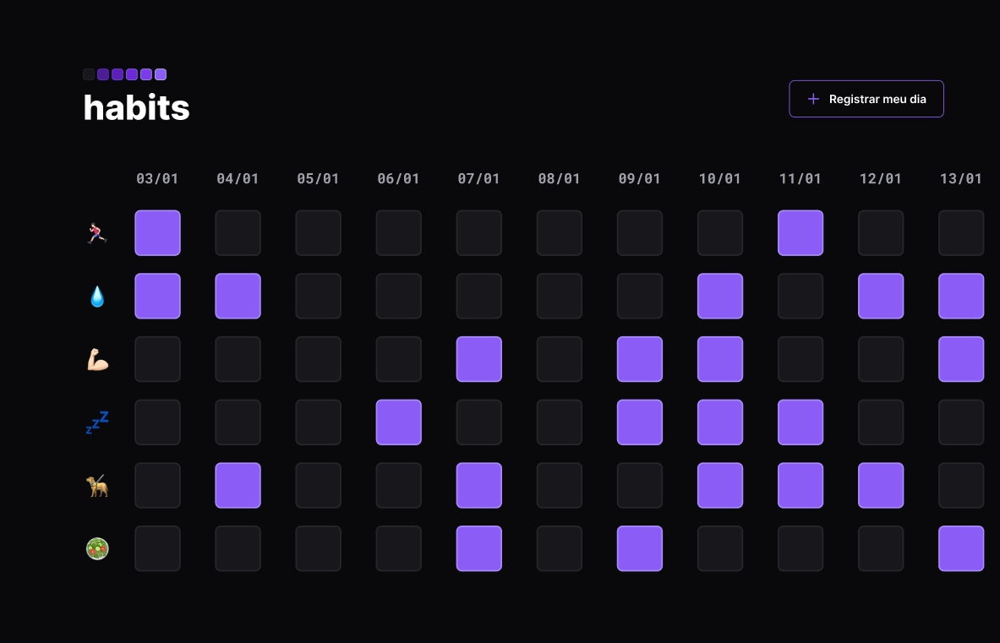

# NLW Setup - Trilha Explorer

Projeto construído no evento Next Level Week (NLW) da Rocketseat.

[📎 Clicando aqui você pode acessar esse projeto!](https://bfalconi.github.io/nlw-setup-explorer)

## 💻 Tecnologias

- HTML
- CSS
- JavaScript
- Git e Github

## 💻 Layout

Você pode visualizar o layout base do projeto através desse [link](https://www.figma.com/file/OmvmPW9T3ByipP7ACNiTBr/Habits-(e)-(Community)?node-id=75%3A128&t=8ia2UXAcvv2OEzAT-0). É necessário ter conta no Figma para acessá-lo.

## 📝 Projeto

É um projeto que auxilia o rastreio de hábitos a serem realizados no cotidiano.

## 📩 Contato

dgabrielfalconi@gmail.com